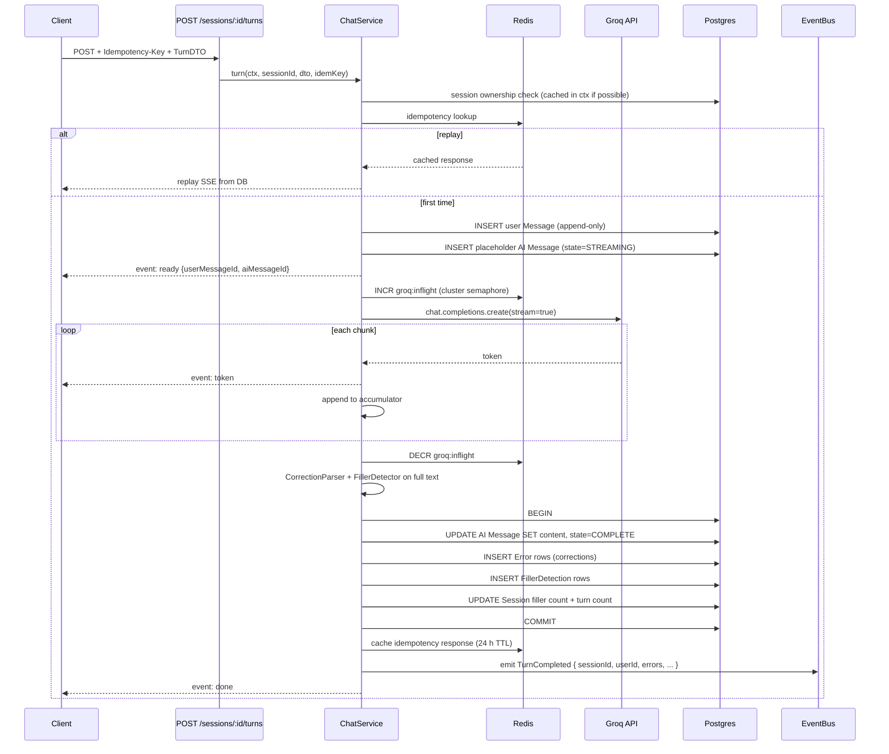
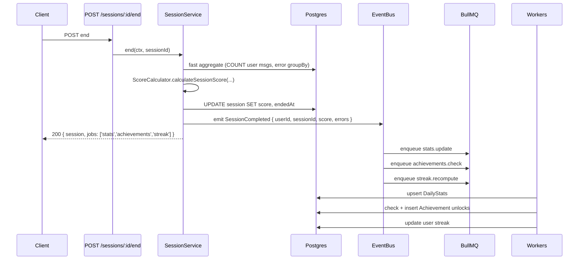
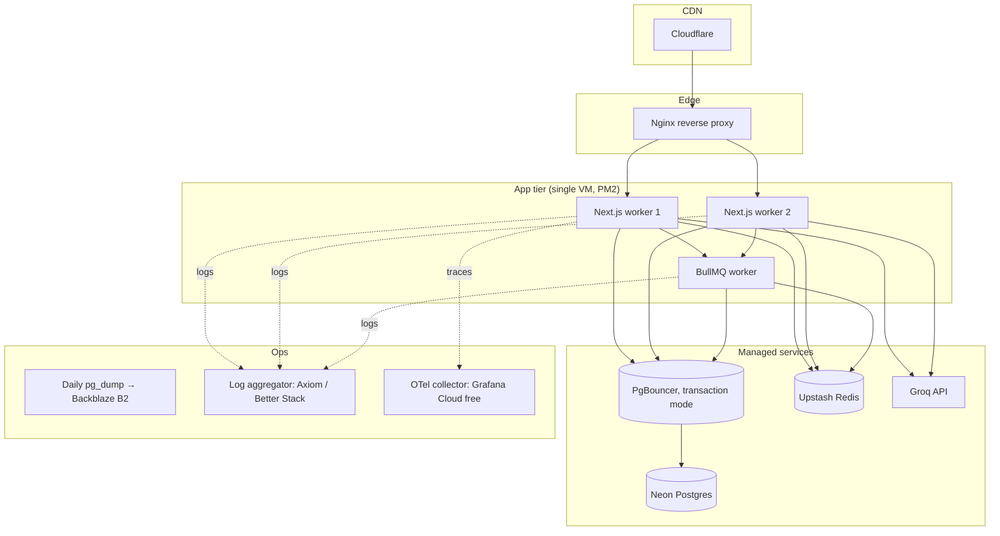
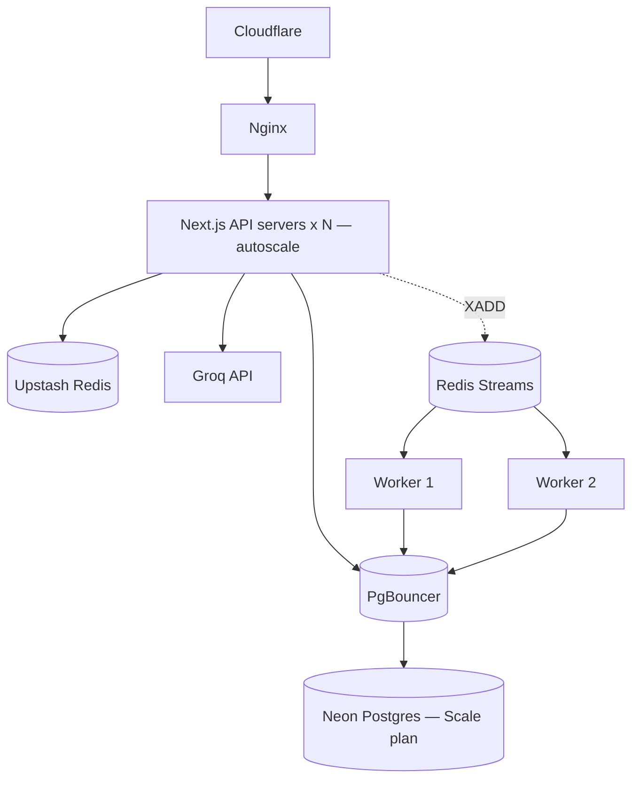

# Talkivo Backend — Target Architecture Spec

> Companion to [ARCHITECTURE_ANALYSIS.md](./ARCHITECTURE_ANALYSIS.md)
> Generated: 2026-04-18
> Scope: full backend redesign for Talkivo AI English Tutor
> Scale target: 10 000 users, 1 000 concurrent, < 300 ms p95 for non-AI endpoints, < 2 s time-to-first-token for chat

---

## 0. Design Principles

1. **Evolutionary, not rewrite.** Every phase ships in production. No "big bang".
2. **Thin handlers, fat services.** Route files parse and respond; services own decisions.
3. **One owner per concern.** Prisma lives behind repositories. Groq lives behind a single client. Redis lives behind a cache module.
4. **Typed end-to-end.** Zod at the boundary; TypeScript types inside; Prisma types at the repository edge only.
5. **Fail fast, fail loud.** Validate env at boot, validate input at the door, surface errors with a `requestId` in every log line.
6. **Idempotent by default.** Any write that a client might retry accepts `Idempotency-Key`.
7. **Boring tech.** Postgres (Neon), Redis (Upstash), BullMQ, Pino, OpenTelemetry. No new exotic dependency.

---

## 1. Functional & Non-Functional Requirements

### Functional
- Users sign up, wait for admin approval, log in.
- Approved users receive a 3-day trial (extendable by admin). After trial, they need an active subscription.
- A user picks a mode (free-talk, role-play, debate, grammar-fix, pronunciation) and a level, and starts a **session**.
- During a session, each **turn** exchanges one user message + one AI message. The server persists both, detects grammar/vocab/structure/fluency errors, tracks filler words, and scores the turn.
- When the session ends, the server recomputes a session score, updates daily stats, and triggers achievement / streak recomputation.
- Admin can approve, reject, extend trial, suspend, bulk-act on users; every action is audited.

### Non-functional

| Attribute | Target |
|---|---|
| Availability | 99.5 % monthly (≈ 3.6 h downtime/month — realistic for single-region Neon) |
| p95 non-AI endpoint | < 300 ms |
| p95 chat time-to-first-token | < 2 s |
| p95 chat time-to-last-token | < 10 s (depends on Groq, ~100-200 tok/s) |
| Concurrent users | 1 000 steady, 2 000 peak |
| DB connections | ≤ 60 % of Neon cap (headroom for migrations + admin) |
| Data durability | RPO 24 h (daily `pg_dump` to off-site blob); RTO 1 h |
| Auth revocation latency | ≤ 60 s on role/status mutation |

### Out of scope for now
Multi-region, ML-based correction scoring, real-time voice (STT/TTS) pipeline, billing/payment integration (admin-granted subscriptions for now).

---

## 2. Capacity Estimation

**Traffic model.**

- 10 000 registered users, assume 30 % WAU → 3 000 WAU.
- Avg active user: 2 sessions/day, 10 turns/session = 20 turns/day.
- WAU turns/day ≈ 3 000 × 20 × (1/7) = 8 570/day across DAU ≈ 430 DAU × 20 = 8 600/day.
- Average chat QPS = 8 600 / 86 400 ≈ **0.1 QPS**. Peak (3×) ≈ **0.3 QPS** — **Groq cost, not throughput, is the constraint.**
- Burst: a classroom demo = 1 000 simultaneous session-starts in 60 s → 17 QPS chat POSTs. Design for this burst.

**Storage (1-year horizon).**

- Messages: 8 600/day × 365 × 500 B ≈ **1.5 GB/yr**.
- Errors: ~30 % of user turns produce 1-2 errors ≈ 1 300 rows/day × 365 × 300 B ≈ **150 MB/yr**.
- Sessions: 860/day × 365 × 1 KB ≈ **315 MB/yr**.
- Vocabulary: 50 words/user/month × 10 000 × 12 × 300 B ≈ **1.8 GB/yr**.
- DailyStats: 3 000 WAU × 7 × 52 × 200 B ≈ **220 MB/yr**.
- **Total ≈ 4 GB/yr.** Neon free tier (512 MB) is already tight; the redesign assumes Neon Launch ($19/mo, 10 GB).

**DB connections.**

- Per request (post-redesign): 1 auth cache lookup (Redis) + 2-4 Prisma queries on hot endpoints.
- With 1 000 concurrent users, assume 5 % in-flight at any moment = 50 concurrent DB-touching requests.
- Via PgBouncer (transaction mode), actual Postgres connections ≈ 10-20. Neon cap ≥ 100.

**Redis ops/s.**

- Rate limiter: ~2 ops per request.
- Auth cache: ~1 op per request (hit rate 95 %).
- Groq semaphore: ~2 ops per chat turn.
- Peak ≈ 200 ops/s. Upstash free tier is fine.

---

## 3. Target Folder Structure

```
src/
  app/
    api/**/route.ts              # thin handlers (≤ 25 lines each)
    (pages, components, …)
  server/
    config/
      index.ts                   # ONE Zod-validated env loader (const config)
    http/
      auth-context.ts            # requireAuth(req) → AuthContext
      middleware/
        idempotency.ts           # idempotency-key middleware
        request-id.ts            # uuid + AsyncLocalStorage
        rate-limit.ts            # per-route decorator
      dto/
        auth.dto.ts
        chat.dto.ts
        session.dto.ts
        message.dto.ts
        vocabulary.dto.ts
        admin.dto.ts
        stats.dto.ts
      responses.ts               # success / paginated / sse / error
    services/
      AuthService.ts             # signup, login, refresh, revoke
      SessionService.ts          # start, end, list, detail
      ChatService.ts             # turn saga (user-msg + Groq + ai-msg + corrections)
      VocabularyService.ts
      AchievementService.ts
      StreakService.ts
      TrialService.ts
      StatsService.ts
      AdminService.ts
    repositories/                # sole owner of Prisma calls
      UserRepository.ts
      SessionRepository.ts
      MessageRepository.ts
      ErrorRepository.ts
      VocabularyRepository.ts
      DailyStatsRepository.ts
      AchievementRepository.ts
      IdempotencyRepository.ts
      RefreshTokenRepository.ts
      AuditLogRepository.ts
    domain/                      # pure, framework-agnostic
      ScoreCalculator.ts         # already exists
      StreakCalculator.ts        # already exists
      CorrectionParser.ts        # moved server-side
      FillerDetector.ts
      errors.ts                  # DomainError hierarchy
    events/
      bus.ts                     # EventBus interface + in-process impl
      types.ts                   # SessionCompleted, VocabLearned, TurnFinished, …
      subscribers/
        achievements.ts          # on SessionCompleted → check unlocks
        streak.ts                # on SessionCompleted → recompute streak
        stats.ts                 # on SessionCompleted → upsert DailyStats
    jobs/
      queue.ts                   # BullMQ client
      workers/
        stats.worker.ts
        achievements.worker.ts
        cleanup.worker.ts        # prune old idempotency keys, refresh tokens
    infra/
      db.ts                      # Prisma client (singleton), pool config, tx helper
      redis.ts                   # Upstash + helpers: cache, lock, incr
      groq.ts                    # client + Redis semaphore + retry
      logger.ts                  # pino + requestId context
      telemetry.ts               # OpenTelemetry init
      events-bus.redis.ts        # Redis Streams backed bus (Phase 3)
  lib/                           # client-safe utilities ONLY (no Prisma, no env, no Node-only)
    api-client.ts
    speech.ts
    utils.ts                     # safe-json-parse, date helpers
  generated/prisma/
  prisma/
    schema.prisma
    migrations/
tests/
  unit/
  integration/
  e2e/
scripts/
  backup-database.sh
  migrate-approve-existing-users.js
```

**Dependency direction (strict).**
`route → http → service → repository → infra/db`
`service → domain`, `service → events`, `service → infra/{redis,groq,logger}`
Never: route → repository, route → prisma, service → request/response.

---

## 4. Dependency Diagram

```mermaid
graph TB
    subgraph "HTTP Layer (thin)"
        Route[app/api/**/route.ts]
        Ctx[http/auth-context]
        DTO[http/dto/*]
        Resp[http/responses]
    end

    subgraph "Application Layer"
        SvcAuth[AuthService]
        SvcChat[ChatService]
        SvcSession[SessionService]
        SvcVocab[VocabularyService]
        SvcTrial[TrialService]
        SvcStats[StatsService]
        SvcAdmin[AdminService]
    end

    subgraph "Domain (pure)"
        Score[ScoreCalculator]
        Streak[StreakCalculator]
        Parse[CorrectionParser]
        Filler[FillerDetector]
    end

    subgraph "Repositories"
        RUser[UserRepo]
        RSession[SessionRepo]
        RMsg[MessageRepo]
        RErr[ErrorRepo]
        RVocab[VocabRepo]
        RStats[DailyStatsRepo]
        RIdem[IdempotencyRepo]
        RRefresh[RefreshTokenRepo]
        RAudit[AuditLogRepo]
    end

    subgraph "Infra"
        DB[(Postgres — Neon)]
        Redis[(Redis — Upstash)]
        Groq[Groq LLM]
        Queue[BullMQ Queue]
        Log[Pino Logger]
        OTel[OpenTelemetry]
    end

    subgraph "Event Bus"
        Bus[EventBus]
        SubAch[Achievements subscriber]
        SubStreak[Streak subscriber]
        SubStats[Stats subscriber]
    end

    Route --> Ctx
    Route --> DTO
    Route --> Resp
    Route --> SvcAuth & SvcChat & SvcSession & SvcVocab & SvcTrial & SvcStats & SvcAdmin

    Ctx --> RUser
    Ctx --> Redis

    SvcAuth --> RUser --> DB
    SvcAuth --> RRefresh --> DB
    SvcAuth --> Redis

    SvcChat --> RSession --> DB
    SvcChat --> RMsg --> DB
    SvcChat --> RErr --> DB
    SvcChat --> Parse
    SvcChat --> Filler
    SvcChat --> Groq
    SvcChat --> Redis
    SvcChat --> Bus

    SvcSession --> RSession
    SvcSession --> Score
    SvcSession --> Bus

    SvcVocab --> RVocab --> DB
    SvcVocab --> Bus

    SvcTrial --> RUser
    SvcStats --> RStats --> DB

    Bus --> SubAch --> Queue
    Bus --> SubStreak --> Queue
    Bus --> SubStats --> Queue

    Queue --> DB

    Route -.-> Log
    Route -.-> OTel
```



---

## 5. Data Model (Target Schema)

### 5.1 Changes from current

| Field | Now | Target | Reason |
|---|---|---|---|
| `Session.vocabularyJson` | `String @default("[]")` | **dropped** | Superseded by `Vocabulary` table |
| `Session.fillerDetails` | `String @default("[]")` | `FillerDetection` relation or `Json` column | Queryable, typed |
| `Message.corrections` | `String?` | **dropped** | Already duplicated into `Error` rows |
| `DailyStats.date` | `DateTime` | `Date @db.Date` | TZ correctness |
| `Achievement.type` | `String` | `AchievementType` enum | Data integrity |
| `Session.score` | `Int?` | `Int? @db.SmallInt` | 0-100 fits in 2 bytes |
| new: `RefreshToken` | — | table | `jti` revocation |
| new: `IdempotencyKey` | — | table | retry-safe writes |
| new: `AuditLog` | — | table | admin action trail |

### 5.2 New / changed Prisma schema (extract)

```prisma
model RefreshToken {
  jti        String   @id                              // UUID, embedded in refresh JWT
  userId     String
  user       User     @relation(fields: [userId], references: [id], onDelete: Cascade)
  issuedAt   DateTime @default(now())
  expiresAt  DateTime
  revokedAt  DateTime?
  userAgent  String?
  ip         String?

  @@index([userId])
  @@index([expiresAt])
}

model IdempotencyKey {
  key         String   @id                             // client-provided UUID
  userId      String?                                  // null for anon endpoints (signup)
  method      String
  path        String
  requestHash String                                   // SHA-256 of body — reject if mismatch
  statusCode  Int
  responseBody Json
  createdAt   DateTime @default(now())
  expiresAt   DateTime                                 // TTL-based cleanup

  @@index([expiresAt])
  @@index([userId])
}

model AuditLog {
  id          String   @id @default(cuid())
  actorId     String                                   // admin user id
  actor       User     @relation("AuditActor", fields: [actorId], references: [id])
  action      AuditAction
  targetType  String                                   // 'User' | 'Session' | ...
  targetId    String
  diff        Json?                                    // before/after snapshot
  ip          String?
  createdAt   DateTime @default(now())

  @@index([actorId, createdAt])
  @@index([targetType, targetId])
  @@index([createdAt])
}

enum AuditAction {
  USER_APPROVE
  USER_REJECT
  USER_SUSPEND
  TRIAL_GRANT
  TRIAL_EXTEND
  USER_BULK_ACTION
  ROLE_CHANGE
}

enum AchievementType {
  FIRST_SESSION
  STREAK_3
  STREAK_7
  STREAK_30
  VOCAB_10
  VOCAB_50
  VOCAB_200
  SCORE_80
  SCORE_95
  MODE_ALL
}

model FillerDetection {
  id         String  @id @default(cuid())
  messageId  String
  message    Message @relation(fields: [messageId], references: [id], onDelete: Cascade)
  word       String
  position   Int
  confidence Float

  @@index([messageId])
}

// Additions / changes on existing tables

model User {
  // ... existing fields
  refreshTokens RefreshToken[]
  auditActions  AuditLog[] @relation("AuditActor")

  @@index([role, status, createdAt])                  // admin list
  @@index([subscriptionStatus, trialEndsAt])          // existing
}

model Session {
  // ... existing fields minus vocabularyJson (DROPPED)
  // fillerDetails stays as-is for Phase 1, migrates to FillerDetection in Phase 4
  score Int? @db.SmallInt

  @@index([userId, createdAt(sort: Desc)])
}

model Message {
  // ... existing fields minus `corrections` column (DROPPED — use Error relation)
  fillerDetections FillerDetection[]
}

model Vocabulary {
  // ... existing
  @@index([userId, reviewedAt])
  @@index([userId, mastery])
}

model DailyStats {
  // ... existing
  date DateTime @db.Date                              // was DateTime

  @@index([userId, date(sort: Desc)])
}
```

### 5.3 Migration plan

| # | Migration | Risk | Rollback |
|---|---|---|---|
| M1 | Add `RefreshToken`, `IdempotencyKey`, `AuditLog`, enums | Low | drop tables |
| M2 | Add new indexes (user/session/vocabulary/stats) | Low, but `CONCURRENTLY` | `DROP INDEX CONCURRENTLY` |
| M3 | `Session.score` → `SmallInt` | Low | type change back |
| M4 | `DailyStats.date` → `Date @db.Date` | Medium (casts existing values) | keep old column in parallel for one release, backfill, swap |
| M5 | Introduce `FillerDetection` table, backfill from `fillerDetails` JSON | Medium, multi-step | keep `fillerDetails` until fully migrated |
| M6 | Drop `Session.vocabularyJson` | Low after readers removed | keep column, stop writing first |
| M7 | Drop `Message.corrections` | Low after readers removed | same pattern |

All writes moved to new model **before** drop. Prisma migrations run via `prisma migrate deploy` in CI before deploy.

---

## 6. API Design (v1)

All endpoints under `/api/v1/…`. One error envelope everywhere:

```json
{ "error": { "code": "NOT_FOUND", "message": "Session not found", "requestId": "01HX…" } }
```

All non-GET endpoints accept `Idempotency-Key: <uuid>` header.
All endpoints return `X-Request-Id` header.

### 6.1 Auth

| Method | Path | Auth | Body/Query | Response |
|---|---|---|---|---|
| POST | `/api/v1/auth/signup` | none | `SignupDTO` | 201 `{user}` |
| POST | `/api/v1/auth/login` | none | `LoginDTO` | 200 `{access, refresh, user}` |
| POST | `/api/v1/auth/refresh` | refresh JWT | — | 200 `{access, refresh}` — rotates `jti` |
| POST | `/api/v1/auth/logout` | refresh JWT | — | 204 (revoke `jti`) |
| GET | `/api/v1/auth/me` | access JWT | — | 200 `{user, subscription}` |

**DTOs.**
```ts
export const SignupDTO = z.object({
  name: z.string().min(2).max(100).trim(),
  phone: z.string().regex(/^(\+91)?[6-9]\d{9}$/)
          .transform(p => p.replace(/[\s\-\(\)]/g, '')),
  email: z.string().email().max(254).toLowerCase(),
  password: z.string().min(8).max(128),
});
export const LoginDTO = SignupDTO.pick({ email: true, password: true })
  .extend({ rememberMe: z.boolean().default(false) });
```

**Tokens.**
- Access JWT: 15 min, HS256, payload `{sub: userId, role, status, jti}`
- Refresh JWT: 30 d, HS256, payload `{sub: userId, jti}` where `jti` references a `RefreshToken` row. Revocation = row delete.

### 6.2 Chat

| Method | Path | Auth | Body | Response |
|---|---|---|---|---|
| POST | `/api/v1/sessions` | sub | `{mode, level}` | 201 `{session}` |
| GET | `/api/v1/sessions` | sub | `?page,pageSize` | 200 paginated |
| GET | `/api/v1/sessions/:id` | sub | — | 200 `{session, messages, errors, vocabulary}` |
| POST | `/api/v1/sessions/:id/end` | sub | — | 200 `{session}` (triggers async stats/achievements via event bus) |
| POST | `/api/v1/sessions/:id/turns` | sub | `TurnDTO` | 200 SSE stream (envelope protocol below) |
| GET | `/api/v1/sessions/:id/messages` | sub | — | 200 `{messages}` |

**TurnDTO.**
```ts
export const TurnDTO = z.object({
  message: z.string().min(1).max(4_000),
  pronunciationScore: z.number().min(0).max(100).optional(),
  audioDurationMs: z.number().int().nonnegative().optional(),
  clientContext: z.object({
    topic:          z.string().max(200).optional(),
    scenario:       z.string().max(200).optional(),
    character:      z.string().max(200).optional(),
    userRole:       z.string().max(200).optional(),
    debateTopic:    z.string().max(200).optional(),
    debatePosition: z.string().max(200).optional(),
  }).optional(),
});
```

**Turn response — SSE envelope.**

```
event: ready
data: {"userMessageId":"msg_…","aiMessageId":"msg_…","requestId":"01HX…"}

event: token
data: {"t":"Hello"}

event: token
data: {"t":"!"}

event: correction
data: {"type":"GRAMMAR","original":"I goed","corrected":"I went","explanation":"…"}

event: done
data: {"score":82,"errors":1,"fillerCount":0}

--- or on failure ---

event: error
data: {"code":"GROQ_TIMEOUT","retryable":true,"requestId":"01HX…"}
```

Client reconciles by `aiMessageId`. On retry with same `Idempotency-Key` the server replays the saved partial/final assistant message from DB.

### 6.3 Vocabulary

| Method | Path | Auth | Body | Response |
|---|---|---|---|---|
| GET | `/api/v1/vocabulary` | sub | `?page,pageSize,sortBy,sortOrder` | 200 paginated |
| POST | `/api/v1/vocabulary` | sub | `{sessionId?, word, definition?, context, source}` | 200 `{vocabulary}` |
| PATCH | `/api/v1/vocabulary/:id` | sub | `{mastery?, definition?}` | 200 `{vocabulary}` |
| POST | `/api/v1/vocabulary/:id/review` | sub | `{remembered: boolean}` | 200 `{vocabulary}` |
| POST | `/api/v1/vocabulary/review` | sub | — | 200 `{due: [...]}` spaced-repetition fetch |

### 6.4 Stats

| Method | Path | Auth | Query | Response |
|---|---|---|---|---|
| GET | `/api/v1/stats/summary` | access | — | 200 `{sessions, avgScore, streakDays, wordsLearned, minutesToday}` |
| GET | `/api/v1/stats/progress` | access | `?period=7d\|30d\|90d\|all` | 200 `{data: DailyStats[]}` |
| GET | `/api/v1/stats/streak` | access | — | 200 `{current, longest, lastDate}` |

### 6.5 Admin

| Method | Path | Auth | Body/Query | Response |
|---|---|---|---|---|
| GET | `/api/v1/admin/users` | admin | `?status,search,page,pageSize` | 200 paginated |
| GET | `/api/v1/admin/users/:id` | admin | — | 200 `{user, lastSession, auditTrail}` |
| POST | `/api/v1/admin/users/:id/approve` | admin | — | 200 |
| POST | `/api/v1/admin/users/:id/reject` | admin | `{reason}` | 200 |
| POST | `/api/v1/admin/users/:id/trial` | admin | `{days}` | 200 |
| POST | `/api/v1/admin/users/:id/suspend` | admin | `{reason}` | 200 |
| POST | `/api/v1/admin/users/bulk` | admin | `{action, userIds}` | 200 `{processed, failed}` |
| GET | `/api/v1/admin/stats` | admin | — | 200 `{totalUsers, activeTrials, revenue?, avgSessionScore}` |
| GET | `/api/v1/admin/audit` | admin | `?actorId,action,from,to,page` | 200 paginated |

### 6.6 Health

| Method | Path | Auth | Response |
|---|---|---|---|
| GET | `/api/v1/health` | none | `{status, db, redis, groqQueue, uptime, version}` |
| GET | `/api/v1/health/ready` | none | 200 if DB + Redis reachable, else 503 |
| GET | `/api/v1/health/live` | none | 200 unconditional (kube liveness) |

---

## 7. Deep Dive: Auth Context

**Goal.** Replace the middleware cascade (which currently issues 2 DB queries per request and uses `new NextRequest(...as any)`) with a single, typed helper.

```ts
// src/server/http/auth-context.ts
import { AsyncLocalStorage } from 'node:async_hooks';
import type { NextRequest } from 'next/server';
import { redis } from '@/server/infra/redis';
import { userRepo } from '@/server/repositories/UserRepository';
import { verifyAccessToken } from '@/server/services/AuthService';
import { ApiError } from '@/server/domain/errors';

export interface AuthContext {
  userId: string;
  email: string;
  role: 'USER' | 'ADMIN';
  status: 'APPROVED' | 'PENDING' | 'REJECTED';
  subscription: { status: SubscriptionStatus; trialEndsAt: Date | null };
  requestId: string;
}

export const ctxStore = new AsyncLocalStorage<AuthContext>();
const AUTH_CACHE_TTL_SECONDS = 60;

export async function requireAuth(req: NextRequest): Promise<AuthContext> {
  const header = req.headers.get('authorization');
  if (!header?.startsWith('Bearer ')) throw ApiError.unauthorized('No token');
  const payload = verifyAccessToken(header.slice(7));          // signature only — no DB

  const cached = await redis.get<AuthBundle>(`auth:${payload.sub}`);
  const bundle = cached ?? await loadAndCache(payload.sub);

  if (!bundle) throw ApiError.unauthorized('User no longer exists');
  if (bundle.role !== 'ADMIN' && bundle.status !== 'APPROVED')
    throw ApiError.forbidden('Account not approved');

  return {
    userId: bundle.id,
    email: bundle.email,
    role: bundle.role,
    status: bundle.status,
    subscription: { status: bundle.subscriptionStatus, trialEndsAt: bundle.trialEndsAt },
    requestId: req.headers.get('x-request-id') ?? crypto.randomUUID(),
  };
}

export async function requireActiveSubscription(req: NextRequest): Promise<AuthContext> {
  const ctx = await requireAuth(req);
  if (ctx.role === 'ADMIN') return ctx;
  const effective = await trialService.checkAndExpire(ctx.userId, ctx.subscription);
  if (effective !== 'TRIAL') throw ApiError.forbidden('Trial expired');
  return ctx;
}

export async function requireAdmin(req: NextRequest): Promise<AuthContext> {
  const ctx = await requireAuth(req);
  if (ctx.role !== 'ADMIN') throw ApiError.forbidden('Admin only');
  return ctx;
}

async function loadAndCache(userId: string) {
  const bundle = await userRepo.findAuthBundle(userId);          // ONE query, all fields
  if (bundle) await redis.setex(`auth:${userId}`, AUTH_CACHE_TTL_SECONDS, bundle);
  return bundle;
}

export function invalidateAuthCache(userId: string) {            // called by AdminService
  return redis.del(`auth:${userId}`);
}
```

**Route usage.**

```ts
// src/app/api/v1/sessions/route.ts
export const POST = handler(async (req) => {
  const ctx = await requireActiveSubscription(req);
  const dto = await parseBody(req, CreateSessionDTO);
  const session = await sessionService.create(ctx.userId, dto);
  return success(session, 201);
});
```

**Properties.**
- **Zero or one DB query per request** (95 % Redis hit rate typical).
- **No request cloning, no `as any`, no header injection.**
- **60 s revocation latency** — sufficient; `invalidateAuthCache` on mutation brings it to ms.
- **AsyncLocalStorage** propagates `requestId` and `userId` to logs and spans without threading them through every call.

---

## 8. Deep Dive: Chat Turn Saga

### 8.1 Current (broken) flow

Client → `POST /api/chat` → Groq stream → response. **Server persists nothing.** Client then calls `POST /api/messages` twice (user + AI). Tab close mid-stream = lost AI response.

### 8.2 Target flow



**Contract properties.**
- **Exactly-once** assistant message, even across retries (idempotency key + append-only message with state).
- **Durable mid-stream failure.** If Groq errors mid-stream, the AI message row stays in `STREAMING` state with whatever tokens arrived. Client retrying with same idem key gets `event: ready` pointing at the same `aiMessageId`, then server resumes from Groq (or returns partial with `retryable: true`). Policy choice: resume vs re-prompt; simplest = re-prompt and overwrite.
- **Server-side correction parsing.** Removes prompt-injection-via-client-parser risk. `CorrectionParser` becomes a trusted module.
- **Redis-backed semaphore.** Cluster-safe. Heals on worker crash via key TTL.

### 8.3 Groq client (target)

```ts
// src/server/infra/groq.ts
const MAX_IN_FLIGHT = config.GROQ_MAX_CONCURRENT;                 // cluster-wide
const SEM_TTL_SECONDS = 120;                                      // heals after crash

async function acquireSlot(): Promise<void> {
  const count = await redis.incr('groq:inflight');
  if (count === 1) await redis.expire('groq:inflight', SEM_TTL_SECONDS);
  if (count > MAX_IN_FLIGHT) {
    await redis.decr('groq:inflight');
    throw ApiError.serviceUnavailable('AI busy — please retry');
  }
}
async function releaseSlot(): Promise<void> {
  await redis.decr('groq:inflight');
}

export async function* chatStream(input: ChatInput): AsyncGenerator<string> {
  await acquireSlot();
  try {
    const stream = await withGroqRetry(() =>
      groq.chat.completions.create({ ...input, stream: true }),
    );
    for await (const chunk of stream) {
      const tok = chunk.choices[0]?.delta?.content;
      if (tok) yield tok;
    }
  } finally {
    await releaseSlot();
  }
}
```

Note: retry applies to *connection acquisition*, not mid-stream — mid-stream errors propagate and the saga decides.

---

## 9. Deep Dive: Session End + Event Bus + Jobs

### 9.1 Current flow (bloated hot path)

`PATCH /api/sessions/:id` runs 4 reads, a transaction with 3 more reads, an upsert, and a vocabulary count — all synchronously before the HTTP response. User waits.

### 9.2 Target flow



**Properties.**
- Hot path = 2 queries + 1 transaction. p95 drops from ~500 ms to ~80 ms.
- Analytics tolerates eventual consistency (a few seconds).
- Job failures retried by BullMQ (exponential backoff, dead-letter queue).
- Event bus starts as in-process (Phase 3) then upgrades to Redis Streams (Phase 5) if you split the API from workers.

### 9.3 EventBus interface

```ts
// src/server/events/bus.ts
export interface DomainEvent<T extends string = string> {
  type: T;
  occurredAt: Date;
  payload: unknown;
  correlationId: string;
}
export interface EventBus {
  emit<E extends DomainEvent>(event: E): Promise<void>;
  on<E extends DomainEvent>(type: E['type'], handler: (e: E) => Promise<void>): void;
}
```

Two implementations:
1. `InProcessEventBus` — simple EventEmitter, runs subscribers in the same Node process via `setImmediate` (doesn't block the response).
2. `RedisStreamsEventBus` — `XADD session.completed`; workers `XREADGROUP`. Used once workers are a separate process.

---

## 10. Deployment Topology

### 10.1 Phase 1-4 (current shape, hardened)



**Why PgBouncer.** Neon pools connections at the wire level, but PgBouncer in transaction mode in front lets the app use many more "virtual" connections than the 3-per-worker cap allows, while Neon sees only a few. Prisma Neon adapter handles prepared-statement issues with `?pgbouncer=true`.

### 10.2 Phase 5+ (split API and workers)



App tier is stateless — deploy on Fly.io / Render / ECS Fargate / Cloud Run. Workers scale independently.

---

## 11. Observability

### 11.1 Logging (Pino)

```ts
// src/server/infra/logger.ts
import pino from 'pino';
import { ctxStore } from '@/server/http/auth-context';

const base = pino({
  level: config.LOG_LEVEL ?? 'info',
  redact: ['req.headers.authorization', 'req.headers.cookie', '*.password', '*.token'],
  formatters: { level: (l) => ({ level: l }) },
});

export const logger = new Proxy(base, {
  get(target, prop) {
    const ctx = ctxStore.getStore();
    if (!ctx) return Reflect.get(target, prop);
    return (target as any).child({ requestId: ctx.requestId, userId: ctx.userId })[prop as string].bind(target);
  },
});
```

Every log line in a request carries `requestId` + `userId` automatically. **Do not silence `warn` in production** — that's where Groq 429 pressure shows up first.

### 11.2 Tracing (OpenTelemetry)

- Auto-instrument HTTP + Prisma + Redis.
- Custom spans around: `ChatService.turn`, `Groq.acquireSlot`, `Groq.stream`, `SessionService.end`, each subscriber.
- Export to Grafana Cloud (free tier) or self-host Tempo.

### 11.3 Metrics (Prometheus-compatible `/metrics`)

- `http_requests_total{route,method,status}` counter
- `http_request_duration_seconds{route,method}` histogram
- `groq_inflight` gauge (from Redis)
- `groq_queue_wait_seconds` histogram
- `db_pool_in_use` gauge
- `idempotency_hits_total` counter
- `auth_cache_hits_total` / `_misses_total`
- `job_duration_seconds{queue,name}` histogram
- `trial_expiries_total` counter

### 11.4 Alerts (minimum)

| Signal | Threshold | Action |
|---|---|---|
| `http_5xx_rate > 2 %` for 5 min | page | page oncall |
| `groq_inflight >= MAX × 0.9` for 2 min | warn | scale semaphore / notify Groq limits |
| `db_pool_in_use >= max × 0.8` for 1 min | warn | investigate slow queries |
| `p95 /chat turn > 5 s` for 10 min | warn | Groq degradation |
| `job_failed_total > 10 in 5 min` | warn | worker logs |
| `/health/ready` fail > 30 s | critical | auto-restart |

---

## 12. Security Hardening (in-redesign)

- Short access token (15 min) + rotating refresh token with `jti` → row-level revocation.
- bcrypt rounds 12 (+ rehash on next successful login with migration flag).
- CSP + HSTS + `X-Frame-Options: DENY` headers set in Next config.
- Rate limits (Redis-backed, sliding window) on every POST, stricter on auth endpoints.
- Idempotency keys on all write endpoints.
- Audit log for every admin mutation, including `diff` of before/after state.
- Password reset tokens as one-use, short-lived, with server-side table (not signed JWT).
- Replace `ValidatePhone`/`ValidateEmail` with Zod schemas at the boundary (one truth).
- No stack traces in production error responses — only `{code, message, requestId}`.

---

## 13. Testing Strategy

| Layer | Tool | What to cover |
|---|---|---|
| Domain (pure) | Vitest | `ScoreCalculator`, `StreakCalculator`, `CorrectionParser`, `FillerDetector`. 100 % branch coverage feasible. |
| Services | Vitest + in-memory fakes | `ChatService.turn` happy path + idempotent replay + mid-stream error; `SessionService.end` + event emission; `TrialService.checkAndExpire`. Use fake repos, fake event bus. |
| Repositories | Vitest + Testcontainers Postgres | Hit real Postgres in CI; verify Prisma queries / transactions / index usage. |
| Routes | Vitest + next/test | Zod error shapes, auth gates, idempotency replay, rate limit 429. |
| End-to-end | Playwright | Signup → admin approves → login → start session → chat turn → end session → stats update. One happy path, one error path. |

**Fixtures.** Factory functions (`makeUser`, `makeSession`) not raw inserts. Avoid shared mutable state between tests. Every test starts in a transaction that rolls back at teardown (Testcontainers).

---

## 14. Phased Rollout (with exit criteria)

### Phase 1 — Foundations (1 week)
- [ ] `src/server/config/index.ts`: one Zod config object. Replace `env.ts`.
- [ ] `src/server/infra/{db,redis,logger,telemetry}.ts` scaffolding.
- [ ] `UserRepository` + `SessionRepository` only. Move all `db.user.*` and `db.session.*` behind them.
- [ ] `http/auth-context.ts`: `requireAuth` / `requireActiveSubscription` / `requireAdmin`. Delete `withAuth` / `withActiveSubscription` / `withAdmin` wrappers. Every route migrated.
- [ ] Redis auth-bundle cache (60 s TTL).
- [ ] Pino logger with AsyncLocalStorage `requestId`.

**Exit criteria.** Zero double-DB-query on auth path (verified with OTel). No `as any` in `src/server`. All existing tests pass.

### Phase 2 — Chat correctness (1-2 weeks)
- [ ] `ChatService.turn()` saga.
- [ ] `POST /api/v1/sessions/:id/turns` endpoint with SSE envelope protocol.
- [ ] Server-side `CorrectionParser` + `FillerDetector` (moved from client).
- [ ] Idempotency keys (Redis-backed) on chat, message, session POSTs.
- [ ] Redis-backed Groq semaphore with TTL heal.
- [ ] Feature flag to route old `/api/chat` traffic to the new endpoint. Old endpoint stays as adapter, logs deprecation warnings.

**Exit criteria.** Tab-close mid-stream = AI message persisted. Retry with same idem key = same response. No per-process semaphore.

### Phase 3 — Scale & observability (1-2 weeks)
- [ ] BullMQ queue + first workers (stats, achievements, streak).
- [ ] `SessionService.end` emits events instead of synchronous writes.
- [ ] OpenTelemetry + Grafana Cloud dashboard.
- [ ] Prometheus `/metrics`.
- [ ] PgBouncer in front of Neon.
- [ ] Alerts wired.

**Exit criteria.** p95 `/sessions/:id/end` < 100 ms. Grafana dashboard shows `requestId`-traceable chat turns.

### Phase 4 — Data model cleanup (1 week + migrations)
- [ ] `DailyStats.date` → `Date @db.Date` (migration M4).
- [ ] `FillerDetection` table (M5).
- [ ] Drop `Session.vocabularyJson` (M6).
- [ ] Drop `Message.corrections` (M7, uses Error relation).
- [ ] Add missing indexes (M2).
- [ ] `AchievementType` enum.
- [ ] `AuditLog` + wire from `AdminService`.

**Exit criteria.** No stringified-JSON columns. All admin mutations produce audit rows.

### Phase 5 — Auth hardening (3-5 days)
- [ ] Short access (15 min) + refresh (30 d) with `jti` table.
- [ ] `/auth/refresh` + `/auth/logout` endpoints.
- [ ] `invalidateAuthCache` on role/status/subscription mutation.
- [ ] bcrypt rounds 12 (with lazy rehash).
- [ ] `passwordResetToken` table + endpoints (if needed).

**Exit criteria.** Token revocation < 5 s end-to-end. No DB hit on the hot auth path (confirmed via OTel).

### Phase 6 — Optional, scale > 10 K
- [ ] Split API and worker processes.
- [ ] Redis Streams event bus.
- [ ] Horizontal autoscale on Fly.io / Render.
- [ ] Multi-region read replicas for stats.

---

## 15. Trade-offs & Alternatives

| Choice | Alternative considered | Why chosen |
|---|---|---|
| Repository + service, not DDD aggregates | Full DDD with aggregate roots | Overkill for a 6-entity domain; repo-service is enough until invariant violations start appearing. |
| BullMQ | pgBoss | pgBoss avoids Redis; BullMQ chosen because Redis is already present and BullMQ has better UIs, backoff, streams. Swap is 1 day if Redis becomes too expensive. |
| In-process EventBus first, Redis Streams later | Redis Streams from day 1 | Simpler, fewer failure modes. Upgrade path is clear when API/worker split happens. |
| Short access + refresh JWT | Server-side sessions | JWT access tokens avoid a DB hit on the hot path (the whole point). Refresh token gives revocation. |
| Zod at boundaries | io-ts, yup, runtype | Already the project's choice and the ecosystem winner in 2026. |
| SSE envelope protocol | WebSockets | SSE is one-way server→client which matches chat; simpler than WS; works through proxies; Next.js handles it natively. |
| Pino + OTel | Datadog, New Relic | Cost. Free Grafana Cloud + Axiom tier covers 10 K-user scale. |
| PgBouncer | Neon native pooling only | Prisma on Neon with larger `max` is fine; PgBouncer wins once workers + API both open connections. Phase 3. |
| Keep Next.js App Router | Fastify / NestJS monolith | Frontend and API share the repo and types; migration cost would be measured in weeks and bring no scale benefit at this size. |

---

## 16. Failure Modes & Mitigations

| Failure | Symptom | Mitigation |
|---|---|---|
| Neon down | All writes fail, reads may work briefly | `/health/ready` returns 503; Cloudflare caches static; incident banner flips on; daily `pg_dump` off-site. |
| Redis (Upstash) down | Auth cache misses (DB fallback still works), rate limiter opens, Groq semaphore fails open | Graceful degrade: auth cache misses = direct DB read; rate limiter = allow; Groq semaphore = fall back to per-process semaphore. Alert on degrade. |
| Groq down / quota hit | Chat returns `event: error {retryable: true}` | Client retries with backoff; `/health` surfaces `groq.status=degraded`; admin can flip a global `chat_enabled=false` feature flag. |
| Worker crash mid-job | BullMQ reclaims job after stall timeout | Jobs idempotent (event re-processing OK). `INSERT ... ON CONFLICT DO NOTHING` on achievement unlocks. |
| Mid-stream Groq error | Partial AI message | AI message row stays in `STREAMING` state; idem-key replay resumes. |
| JWT secret rotation | Everyone logged out (breaking) | Support two active secrets during rotation window; verify against both, sign with new. |
| DB migration mid-deploy | App version mismatch | Expand/migrate/contract: add columns first, backfill, then remove. Never drop before the new code ships. |
| Runaway user (DoS) | One user burns Groq quota | Per-user rate limit (30 turns/min) + daily turn cap; admin suspend endpoint. |
| Lost DB / corruption | Data loss | Daily `pg_dump` → Backblaze B2; PITR on Neon Scale plan; test restore monthly. |

---

## 17. File-by-File Migration Checklist (Phase 1-2)

| Current path | Change |
|---|---|
| `src/lib/env.ts` | Move to `src/server/config/index.ts`, expand with Redis, GROQ_MAX_CONCURRENT, TRIAL_DAYS, DB_POOL_MAX, log-level, JWT TTLs. Re-export old `env` during transition. |
| `src/lib/db.ts` | Move to `src/server/infra/db.ts`. Keep Neon adapter. Add a `withTransaction(fn)` helper. |
| `src/lib/groq.ts` | Move to `src/server/infra/groq.ts`. Swap in-memory semaphore for Redis version. |
| `src/lib/rate-limiter.ts` | Move to `src/server/infra/redis.ts` + `src/server/http/middleware/rate-limit.ts`. |
| `src/lib/error-handler.ts` | Split: response helpers → `src/server/http/responses.ts`; `withAuth/withActiveSubscription/withAdmin` → deleted, replaced by `auth-context`. |
| `src/lib/auth.ts` | Keep pure helpers (hash, verify). Move JWT-issuing logic into `AuthService`. Remove `getAuthUser`. |
| `src/lib/services/trial.ts` | Move to `src/server/services/TrialService.ts`. |
| `src/lib/services/{ScoreCalculator,StreakCalculator}.ts` | Move to `src/server/domain/`. No code change. |
| `src/lib/services/CorrectionParser.ts` | Move to `src/server/domain/CorrectionParser.ts`. It stops being client code. |
| `src/lib/services/AchievementChecker.ts` | Move to `src/server/services/AchievementService.ts`. Call from event subscriber, not HTTP. |
| `src/lib/schemas/*` | Move to `src/server/http/dto/*`. Minor renames (Schema → DTO). |
| `src/lib/errors/*` | Move to `src/server/domain/errors.ts`. |
| `src/app/api/**/route.ts` | Rewrite each to: `requireAuth/Sub/Admin → parseDTO → service.call → success(…)`. No Prisma. |
| `src/lib/api-client.ts`, `src/lib/speech.ts`, `src/lib/utils.ts` | Stay — these are client-safe. |

---

## 18. Success Metrics (6-week horizon)

- **p95 `/chat` time-to-first-token < 2 s** (from ~3-5 s today under load).
- **p95 `/sessions/:id/end` < 100 ms** (from ~400-600 ms today).
- **DB queries per authed request: 0 or 1** (from 2-3 today).
- **Zero `as any` in `src/server`.**
- **100 % of admin mutations produce an `AuditLog` row.**
- **Achievement unlocks detected without client-initiated poll.**
- **Token revocation end-to-end ≤ 5 s.**
- **Restored backup boots in < 1 h** (verified drill).
- **All routes covered by at least one integration test hitting real Postgres (Testcontainers).**
