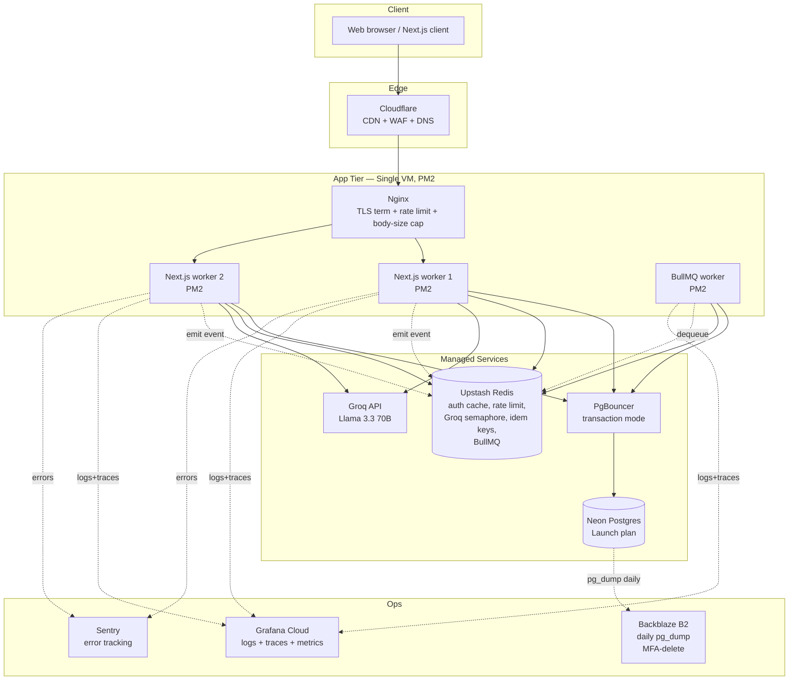
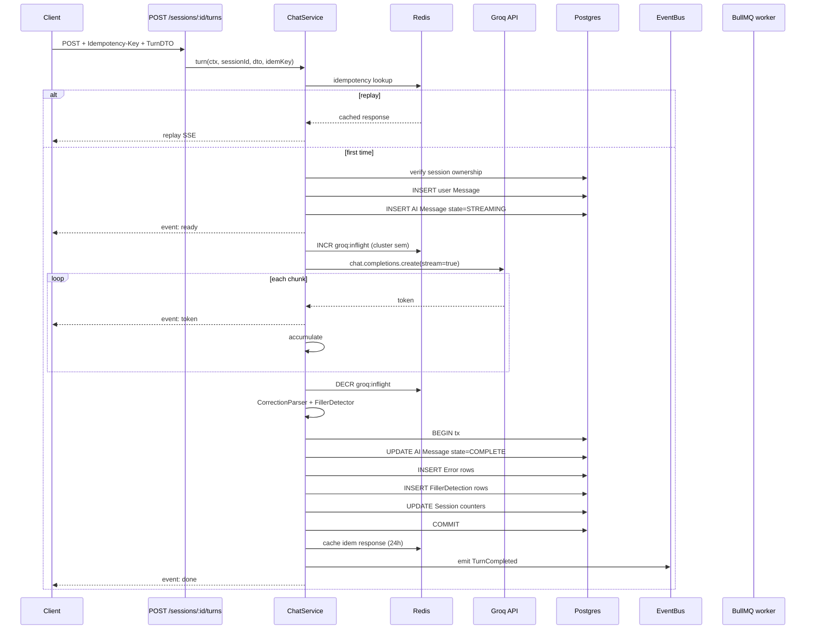
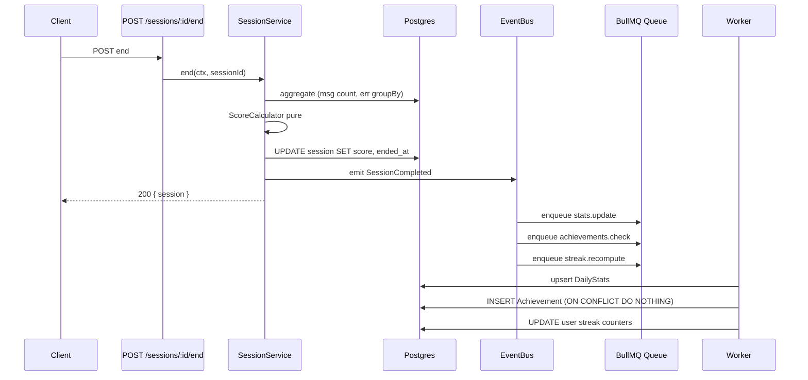

# Talkivo — System Design

> Applies the 9-step workflow from [backend structure/SYSTEM_DESIGN_CHECKLIST.md](../../backend%20structure/SYSTEM_DESIGN_CHECKLIST.md) to Talkivo.
> Companion to [ARCHITECTURE_ANALYSIS.md](ARCHITECTURE_ANALYSIS.md), [BACKEND_REDESIGN.md](BACKEND_REDESIGN.md), [IMPLEMENTATION_PLAN.md](IMPLEMENTATION_PLAN.md).
> Date: 2026-04-19.

---

## Step 1 — Functional Requirements

**Users (student):**
- Sign up with name + phone + email + password.
- Wait for admin approval; see status messages.
- Receive a 3-day trial on approval; extendable by admin.
- Pick a mode (free-talk, role-play, debate, grammar-fix, pronunciation) and a level (beginner, intermediate, advanced) and start a **session**.
- During a session, take **chat turns**: user speaks / types → AI reply streams back with corrections + filler-word detection + per-message pronunciation score.
- End session → receive a session score (0-100).
- See progress stats: streak, minutes/day, score trend, vocabulary learned.
- Review vocabulary with spaced repetition.
- Get achievement unlocks (first session, streak_7, vocab_50, etc.).

**Users (admin):**
- Log in.
- List / search users filtered by status.
- Approve / reject / suspend users.
- Grant or extend trial (3 / 6 / 14 days).
- Bulk actions across multiple users.
- See platform stats (total users, active trials, avg score).
- See audit log of admin actions.

**Out of scope (explicitly):**
- Billing / paid subscriptions (admin grants trials for now).
- Mobile native app (web only).
- Real-time voice (STT/TTS) — speech done client-side via Web Speech API.
- Multi-tenant organizations / teams.
- Content moderation pipeline beyond simple filtering.

---

## Step 2 — Non-Functional Requirements

| Attribute | Target |
|---|---|
| Availability | 99.5% monthly (~3.6 h/month downtime) — single-region Neon realistic |
| p95 non-AI endpoint | < 300 ms |
| p95 chat time-to-first-token | < 2 s |
| p95 chat time-to-last-token | < 10 s (depends on Groq) |
| p95 session-end | < 100 ms (after redesign — today ~500 ms) |
| Concurrency | 1 000 steady, 2 000 peak |
| Storage growth | ~4 GB / year |
| Data durability (RPO) | ≤ 24 h — daily pg_dump off-site |
| Recovery (RTO) | ≤ 1 h |
| Auth revocation latency | ≤ 5 s after Phase 5 |
| Consistency | Strong for sessions + trial + auth; eventual OK for stats + achievements |
| Compliance | DPDP (India) + GDPR readiness; no PCI (no payments yet); no HIPAA |

---

## Step 3 — Capacity Estimation

### User model

- Registered users: 10 000 (launch target)
- Weekly active: ~3 000 (30% WAU)
- Daily active: ~430 (14% DAU)

### Traffic

| Metric | Calculation | Value |
|---|---|---|
| Sessions/day | 430 DAU × 2 sessions | ~860 |
| Turns/day | 860 × 10 turns | ~8 600 |
| Avg chat QPS | 8 600 / 86 400 | **~0.1 QPS** |
| Peak chat QPS (×3) | | **~0.3 QPS** |
| Total API RPS peak | includes stats, auth, vocab | **~20 RPS** |
| Classroom-demo burst | 1 000 session-starts in 60 s | **17 QPS** |

**Observation:** Groq cost, not throughput, is the bottleneck. Peak QPS is low. Connection count + GPU-slot contention is what breaks first.

### Storage (1 year)

| Entity | Math | Size |
|---|---|---|
| Messages | 8 600/day × 365 × 500 B | **1.5 GB** |
| Errors (corrections) | 1 300/day × 365 × 300 B | **0.15 GB** |
| Sessions | 860/day × 365 × 1 KB | **0.32 GB** |
| Vocabulary | 50 words/user/month × 10 000 × 12 × 300 B | **1.8 GB** |
| DailyStats | 3 000 WAU × 7 × 52 × 200 B | **0.22 GB** |
| **Total** | | **~4 GB/year** |

Neon Launch tier (10 GB) fits year-1 + buffer.

### Bandwidth

- AI tokens out: 8 600 turns × 300 tokens avg × 4 B/token = **~10 GB/day** streaming from server → clients.
- Cloudflare absorbs ~80% of non-stream responses.

### Third-party cost

- Groq free tier: 30 RPM + 6k tokens/min per key. At 8 600 turns / 1 440 min = 6 turns/min avg → fits easily. Classroom burst needs rate-limit protection.
- Upstash Redis free tier: ~10k ops/day, our ~2 ops/request × 20 RPS × 86 400 s ≈ **3.5 M/day**. Move to pay-as-you-go ($0.2 per 100k ops ≈ $7/day) — plan for Launch tier.
- Neon Launch: $19/mo.

### Compute

- Avg handler CPU: ~20 ms/request.
- 20 RPS × 0.02 s = 0.4 vCPU-seconds/sec = **fits comfortably in 2 PM2 workers on a 2-vCPU box**.
- GPU: all inference via Groq, zero local GPU need.

### DB connections (after redesign)

- Per request: 1 Redis hit for auth + 2-4 Prisma queries.
- Peak: 20 RPS × 4 queries × 50 ms = 4 simultaneous queries on average.
- With PgBouncer transaction mode, 10 pool connections per worker × 2 workers = 20 max. Fits.

---

## Step 4 — API + Data Model

### API Surface (v1)

Full spec in [BACKEND_REDESIGN.md §6](BACKEND_REDESIGN.md). Top-level:

```
POST   /api/v1/auth/signup
POST   /api/v1/auth/login
POST   /api/v1/auth/refresh
POST   /api/v1/auth/logout
GET    /api/v1/auth/me

POST   /api/v1/sessions                     { mode, level }
GET    /api/v1/sessions                     ?page,pageSize
GET    /api/v1/sessions/:id
POST   /api/v1/sessions/:id/turns           TurnDTO → SSE stream
POST   /api/v1/sessions/:id/end

GET    /api/v1/vocabulary                   ?page,pageSize
POST   /api/v1/vocabulary                   { word, context, source, sessionId? }
PATCH  /api/v1/vocabulary/:id
POST   /api/v1/vocabulary/review            -> due words

GET    /api/v1/stats/summary
GET    /api/v1/stats/progress               ?period=7d|30d|90d|all
GET    /api/v1/stats/streak

GET    /api/v1/admin/users                  ?status,search,page,pageSize
POST   /api/v1/admin/users/:id/approve
POST   /api/v1/admin/users/:id/trial        { days }
POST   /api/v1/admin/users/bulk             { action, userIds }
GET    /api/v1/admin/audit

GET    /api/v1/health
GET    /api/v1/health/ready
GET    /api/v1/health/live
```

All writes accept `Idempotency-Key`. Errors: `{error: {code, message, requestId}}`. Success: `{data: ...}` or `{data, meta}`.

### Data Model (Target)

Entities + primary relations:

```
User (id, email, phone, password_hash, role, status, subscription_status, trial_ends_at, ...)
  │
  ├─ RefreshToken (jti, user_id, expires_at, revoked_at, ip, ua)
  ├─ Session (id, user_id, mode, level, started_at, ended_at, score, duration_seconds)
  │     │
  │     ├─ Message (id, session_id, role [user|assistant|system], content, state, token_count)
  │     │     └─ FillerDetection (id, message_id, word, position, confidence)
  │     ├─ Error (id, session_id, category, original, corrected, explanation)
  │     └─ Vocabulary (id, user_id, word, definition, context, source, mastery, reviewed_at)
  ├─ DailyStats (user_id, date @db.Date, sessions_count, avg_score, words_learned, ...)
  └─ Achievement (id, user_id, type AchievementType, unlocked_at)

AuditLog (id, actor_id, action, target_type, target_id, diff, ip, created_at)
IdempotencyKey -> Redis (24h TTL), not DB
```

**Shard key decision:** defer sharding. At 10k users not needed. **When sharding triggers: shard by `user_id`.** All queries already scope by user_id.

**Consistency per subsystem:**

| Subsystem | Model |
|---|---|
| Auth | Strong (DB write) + 60 s eventual on Redis cache |
| Session lifecycle | Strong (transactional) |
| Chat turn messages | Strong within a session, append-only |
| Daily stats | Eventual (updated via BullMQ after session end) |
| Achievements | Eventual |
| Streak | Eventual |
| Audit log | Strong (same transaction as admin mutation) |

---

## Step 5 — High-Level Architecture



### Request Flow — Authenticated Endpoint

```
Client → Cloudflare (TLS, WAF, rate limit edge)
       → Nginx (body cap, proxy to app)
       → Next.js handler
           → requireAuth(req)           : Redis GET auth:userId (60s TTL)
                                        : fallback → UserRepo.findAuthBundle (1 DB query)
           → parseBody(req, DTO)        : Zod validate
           → service.method()
               → repo methods            : 2-4 Prisma queries
               → emit domain event       : Redis XADD or EventEmitter
           → success(data) or error(envelope)
       → response with X-Request-Id header
```

### Chat Turn Flow (SSE Saga)



### Session-End Flow



---

## Step 6 — Deep Dives

### Deep Dive 1 — Auth Context (the most-called code path)

**Problem:** today's middleware does 2 DB queries per authenticated request, uses fragile `new NextRequest(...as any)`, and can't revoke sessions without rotating the JWT secret. At 1 000 concurrent users on a 6-connection pool, this starves the pool before the handler runs.

**Design:**

```
requireAuth(req):
  verifyAccessToken(bearer)                              ← signature only, no DB/Redis
  ctx = redis.get(`auth:${userId}`)                      ← 60s TTL
  if miss:
     ctx = userRepo.findAuthBundle(userId)               ← ONE DB query, full fields
     redis.setex(`auth:${userId}`, 60, ctx)
  enforce: role admin || status APPROVED
  return AuthContext { userId, role, status, subscription, requestId }
```

**Revocation latency ≤ 60 s on passive expiry; ≤ 5 s if mutation calls `invalidateAuthCache(userId)`.**

**Storage:**
- Access JWT: HS256, 15 min, claims `{sub, role, status, jti}`.
- Refresh JWT: HS256 with separate secret, 30 d, claims `{sub, jti}`. Row stored in `refresh_tokens (jti, user_id, expires_at, revoked_at, ip, ua)`.
- Rotation on every refresh; reuse-of-revoked-jti triggers family revocation (all refresh rows for that user deleted).

**Failure modes:**
- Redis down → every request costs 1 DB query (auth bundle). DB pool expected to cope at 20 RPS.
- Token leaked → attacker has up to 15 min access + until next password change for refresh. User hits "logout everywhere" → revokes all.

### Deep Dive 2 — Chat Turn Saga

**Problem:** current `/api/chat` streams Groq output but persists nothing. Client must separately POST `/api/messages` twice (user + AI). If tab closes mid-stream, AI response is lost. Client does correction parsing — prompt-injection surface.

**Design:** one service (`ChatService.turn`) owns the full round-trip. Saga in §5's sequence diagram.

**Key decisions:**
- **Append-only messages.** User message row inserted immediately; AI message inserted in `STREAMING` state immediately. Finalized inside the commit transaction at end.
- **Idempotency via Redis.** Key = client-generated ULID. Replay returns the same `aiMessageId`; server re-streams from DB if already complete.
- **Correction parsing server-side.** `domain/CorrectionParser.ts` + `domain/FillerDetector.ts`. Client never parses.
- **Semaphore in Redis.** `INCR groq:inflight` with 120 s TTL heal. At `GROQ_MAX_CONCURRENT` the request returns 503 fast (better than hanging).
- **Transaction at commit.** UPDATE message + INSERT error rows + INSERT filler rows + INCREMENT session counters all in one tx.

**SSE envelope:**
```
event: ready        { userMessageId, aiMessageId, requestId }
event: token        { t }
event: correction   { type, original, corrected, explanation }
event: done         { score, errors, fillerCount, durationMs }
event: error        { code, retryable, requestId }     -- even this frame is on 200 OK
```

**Failure modes:**
- Groq connection fails pre-stream: retry 3× with backoff. If still failing, 503.
- Groq connection fails mid-stream: AI message stays in `STREAMING`. Client retries with same idem key. Server either (a) returns partial + `retryable: true`, or (b) re-prompts Groq and overwrites (chosen: simpler).
- Client disconnects mid-stream: server still completes accumulation + commit. Next session load shows the full AI reply.
- Redis down: semaphore falls back to per-process (env flag). Loses cluster-safety but app works.

### Deep Dive 3 — Session End + Event Bus + Background Jobs

**Problem:** today `PATCH /sessions/:id` does 4 reads + transactional upsert with 3 more reads inside — synchronously, blocking the user's "end session" click for 400-600 ms.

**Design:**
- `POST /sessions/:id/end` does 2 queries + score calculation + 1 UPDATE, **emits event**, returns.
- `InProcessEventBus` (Phase 3) dispatches `SessionCompleted` to subscribers via `setImmediate` — non-blocking.
- Subscribers enqueue BullMQ jobs:
  - `stats.update` — upsert `DailyStats`.
  - `achievements.check` — detect new unlocks; INSERT ... ON CONFLICT DO NOTHING makes re-processing safe.
  - `streak.recompute` — update user streak columns.

**Idempotency of jobs:** events carry `sessionId`. Re-processing produces identical state. Achievement insert has `@@unique([userId, type])`. Daily stats upsert by `(userId, date)`.

**Upgrade path:** `InProcessEventBus` → `RedisStreamsEventBus` when API + workers split into separate deployments (Phase 6).

**Failure modes:**
- Worker crash mid-job: BullMQ re-delivers after stall timeout.
- Event lost (no outbox yet): stats drift. **Mitigation for money-sensitive future:** add outbox table if we ever add billing.
- Job storm from a user hammering session-end: BullMQ job-key deduplication + rate limit on endpoint.

---

## Step 7 — Trade-Offs

| Decision | Alternative | Why chosen | What would make us revisit |
|---|---|---|---|
| Modular monolith (Next.js + /server layers) | Microservices | Team of 1-2; bounded contexts clean enough; deploy simpler | Team grows past 5 engineers; one subsystem needs independent scaling |
| Postgres (Neon) | Cassandra, MongoDB | Scale doesn't justify NoSQL; rich features; team knows SQL; transactional guarantees for money-adjacent (trials) | Write throughput > 30 k/sec; chat history > 100 GB |
| Groq (managed) | Self-host vLLM on GPU | Zero infra, generous free tier, Llama 3.3 70B quality fits | Cost > $500/month at which point reserved GPU beats pay-per-token |
| JWT access + refresh w/ jti | Server-side sessions | Avoids DB hit per request; Redis cache handles revocation ≤ 5 s | If we need sub-second revocation for regulatory reasons |
| BullMQ on Redis | pgBoss on Postgres | Redis already present; better UI; stream support upgrade path | Redis too expensive; Postgres has spare headroom |
| In-process EventBus first | Redis Streams from day 1 | Simpler; fewer failure modes; clear upgrade path | Split API ↔ workers tier |
| SSE for chat | WebSocket | One-way fits chat; proxies handle; Next.js supports natively | Bidirectional needs (voice real-time) |
| Zod at boundaries | io-ts, yup, runtype | Ecosystem leader 2026; already the project's choice | — |
| Neon (managed) | Self-hosted Postgres | One engineer can't own both product + DBA at 10k scale | DBA hired; compliance isolation demanded |
| Cloudflare edge | AWS CloudFront, Fastly | Free tier strong; WAF + Turnstile + Bot Fight bundled | Multi-CDN strategy for > 99.99% availability |
| Single-region | Multi-region | 10k-scale user base in India doesn't justify; Neon single-region | Global customers; p95 target < 200 ms worldwide |

---

## Step 8 — Scaling Strategy

Growth plateaus specific to Talkivo:

| Scale | Likely bottleneck | Response |
|---|---|---|
| **0-1k users** | None (today) | Ship features, finish Phase 1-2 of [IMPLEMENTATION_PLAN](IMPLEMENTATION_PLAN.md) |
| **1k-10k users** (target) | Double-DB-query auth, per-process Groq semaphore, pool at 6 | **Phase 1 + 2 + 3** — redesign is built for this |
| **10k-50k users** | DB write throughput (session end, stats) | Move stats to warehouse (read-only copy via CDC); keep OLTP lean |
| **50k-100k users** | Groq token/minute ceiling | Move to paid Groq tier OR self-host on GPU OR multi-provider fallback (Together.ai, Anthropic, OpenAI) |
| **100k-500k users** | DB pool + single-region latency (global users) | Read replicas per region; sharded user_id; Phase 6 API / worker split |
| **500k+** | Everything else | Sharded cells (like Shopify); multi-region write; team to own platform |

Current (today): 40% of the way to a "real" 10k backend due to the architectural debt in [ARCHITECTURE_ANALYSIS.md](ARCHITECTURE_ANALYSIS.md).

---

## Step 9 — Failure Modes

| Failure | Blast radius | Mitigation |
|---|---|---|
| Neon down | All reads/writes | `/health/ready` 503; Cloudflare caches static; flip `MAINTENANCE_MODE`; PITR on Scale plan |
| Upstash Redis down | Auth cache misses, rate limit opens, Groq semaphore degrades | Graceful degrade: DB fallback for auth; permissive rate limit; per-process semaphore fallback |
| Groq down / quota | Chat broken, rest of app works | Event `error` with `retryable: true`; admin flips `CHAT_ENABLED=false` in < 10 s; consider fallback model |
| Groq mid-stream error | One turn | AI message row stays `STREAMING`; client retries w/ same idem key |
| PM2 worker crash | One worker drops requests | PM2 auto-restart; Nginx drains unhealthy via health check |
| BullMQ worker crash mid-job | Stats / achievements delayed | BullMQ re-delivers after stall timeout; jobs idempotent |
| Refresh token leaked | Up to 30 d attacker access if not detected | Reuse-detection nukes token family on second use of revoked jti |
| JWT secret leaked | All access tokens valid until expiry | Dual-secret rotation runbook (48 h window); rotate and force re-login |
| DB migration fails mid-deploy | App version mismatch | Expand/migrate/contract pattern; old code tolerates new schema |
| Runaway user (spam) | Groq quota + DB load | Per-user chat rate limit (30/min) + 500 turns/day cap; admin suspend |
| Lost backup / corruption | Data loss | Daily pg_dump → Backblaze B2 with MFA-delete; monthly restore drill |
| Compromised admin account | All user data + admin actions | MFA required for admin accounts (Phase 5+); audit log of every admin op |
| DDoS | Site down | Cloudflare WAF + Bot Fight + Under Attack mode |

---

## Step 10 — Design Review Answers

Applying the 16 review questions from [SYSTEM_DESIGN_CHECKLIST §16](../../backend%20structure/SYSTEM_DESIGN_CHECKLIST.md):

1. **End-to-end flow understandable in 5 min?** Yes — three sequence diagrams above.
2. **Biggest bottleneck at 10×?** DB connection pool + Groq token quota. Solved by PgBouncer + Groq Pro.
3. **Region outage blast radius?** 100% of users. Not mitigated today; accept per NFR 99.5%.
4. **DB outage blast radius?** 100%. PITR + maintenance mode + rapid recovery via restore drill.
5. **RPO?** ≤ 24 h (daily pg_dump); ≤ 1 h on Neon Scale plan PITR.
6. **RTO?** ≤ 1 h measured in drill.
7. **Kill switch for riskiest feature?** `CHAT_ENABLED=false` env var flips Groq-dependent routes to 503.
8. **Rollback plan?** `git revert <sha>` + redeploy < 5 min. DB migrations expand/contract safe.
9. **Metrics that tell you system is healthy?** `http_requests_total{status=2xx}` > 98%, `http_request_duration_seconds{route,p95}` within budget, `groq_inflight` < max, DB pool < 80%.
10. **Metrics that tell you it's sick?** Above thresholds breached; refresh-reuse events > 0; queue depth growing; cert expiry < 14 d.
11. **Which dep failure does the design NOT survive?** Simultaneous Neon + Upstash down. Accept — statistically negligible combined outage.
12. **Where's the most PII?** `users.email`, `users.phone`, `users.name`, `messages.content` (user's conversation history). All encrypted at rest, TLS in transit, redacted in logs.
13. **Serve happy path if Redis is down?** Yes with degraded auth cache (DB fallback). Rate limiter opens; Groq semaphore falls back. Not ideal but up.
14. **Serve happy path if BullMQ down?** Sessions + chat continue. Stats drift until queue restored.
15. **Monthly infra cost at 10k users (target)?** ~$100/month. Neon Launch $19, Upstash pay-as-you-go $10-15, Cloudflare free, Grafana Cloud free, Sentry free, small VM $20, Backblaze $3.
16. **Definition of "ship-ready"?** Phase 1-3 complete, security layers 1-4 wired, restore drill done, p95 targets held under load test.

---

## Artifacts Produced (Cross-Links)

- [ARCHITECTURE_ANALYSIS.md](ARCHITECTURE_ANALYSIS.md) — root-cause audit of today's code.
- [BACKEND_REDESIGN.md](BACKEND_REDESIGN.md) — target folder structure, API spec, deep dives (expanded).
- [IMPLEMENTATION_PLAN.md](IMPLEMENTATION_PLAN.md) — 6 phases, per-phase exit criteria, rollback plans.
- [PROD_CHECKLIST_WEB.md](PROD_CHECKLIST_WEB.md) — launch readiness checklist.
- [SECURITY_LAYERS.md](SECURITY_LAYERS.md) — 7 layers + deep auth.
- [LINKS_REVIEW.md](LINKS_REVIEW.md) — external tools applicable to Talkivo.
- Universal reference: [../backend structure/](../../backend%20structure/).

---

## Current State vs Target State (Today's Snapshot)

| Dimension | Today | Target (after Phase 1-5) |
|---|---|---|
| DB queries per auth'd request | 2-3 | 0-1 (Redis cache) |
| Chat turn persistence | Split across /chat + /messages | Single saga, idempotent |
| Groq concurrency | Per PM2 worker | Cluster-wide Redis semaphore |
| Error tracking | stdout only | Sentry w/ requestId tags |
| Audit log | none | AuditLog table w/ every admin mutation |
| Token revocation | 7 days (JWT expiry) | ≤ 5 s |
| Secret scanning | none | GH native + gitleaks pre-commit + CI |
| Dep scanning | none | Dependabot + npm audit + OSV nightly |
| Backup | manual | Daily pg_dump → Backblaze B2 MFA-delete |
| Rollback runbook | informal | `docs/incidents/RUNBOOK.md` tested by non-author |

**Safety score:** ~40% today → ~90% after Phase 1-5.
**Performance target readiness:** p95 `/sessions/:id/end` 400-600 ms today → < 100 ms after Phase 3.

---

## Next Actions

1. Finish [IMPLEMENTATION_PLAN.md Phase 1](IMPLEMENTATION_PLAN.md) — config + infra + UserRepo + SessionRepo + requireAuth. 5-7 engineer-days.
2. Run load test at 100 concurrent users to validate this design.
3. Restore-from-backup drill on the Neon snapshot.
4. Wire `anthropics/claude-code-security-review` GH Action (see [LINKS_REVIEW.md](LINKS_REVIEW.md)).
5. Set up Sentry + Pino + OpenTelemetry (Phase 1 + 3 parallel).
